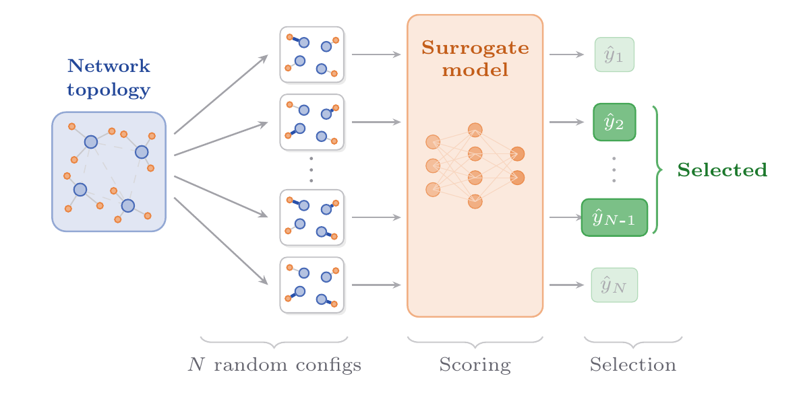

# Surrogate Model is All You Need for Multi-AP Coordination

This repository contains the code for the paper *"Surrogate Model is All You Need for Multi-AP Coordination"*.

We propose a simple yet effective approach to Coordinated Spatial Reuse (Co-SR) scheduling in IEEE 802.11bn (Wi-Fi 8) networks: **draw *N* random configurations, score each with a GNN surrogate model, and select the best ones**. No reinforcement learning, no generative model, no iterative optimization — just a single forward pass through a lightweight graph neural network.

<p align="center">
  
</p>

## How It Works

1. **Random sampling** — Draw *N* random Co-SR configurations (active APs, STA selection, MCS, transmit power) and encode each as a graph
2. **Surrogate scoring** — Score all candidates in a single batched forward pass using a GNN with a Mixture Density Network (MDN) head
3. **Selection** — Pick the best configurations (top-*k* or coverage-based) and apply them in round-robin

## Installation

Requires Python >= 3.12. We recommend using [uv](https://github.com/astral-sh/uv):

```bash
git clone https://github.com/ml4wifi-devs/mapc-surrogate.git
cd mapc-surrogate
uv venv
source .venv/bin/activate
uv sync
```

For GPU support (CUDA 12):

```bash
uv sync --extra gpu
```

## Usage

### Dataset Generation

Generate training and validation datasets from simulated Wi-Fi scenarios:

```bash
cd mapc_surrogate
python dataset.py
```

This creates LZ4-compressed datasets in `mapc_surrogate/datasets/`.

### Training

Train the surrogate model (uses [Hydra](https://hydra.cc/) for configuration):

```bash
cd mapc_surrogate
python training.py
```

Override defaults:

```bash
python training.py model.dim=128 optimizer.learning_rate=1e-3 train.n_steps=20000
```

Training logs are sent to [Weights & Biases](https://wandb.ai/). Checkpoints are saved to `runs/`.

## Project Structure

```
mapc_surrogate/
├── attributes.py        # Edge attribute enums (MCS, tx_power, selected) with JAX PyTree support
├── graphs.py            # Graph construction: WiFi topology → NetworkX → Jraph
├── model.py             # SurrogateModel: edge embedding → GNN + Transformer → MDN head
├── dataset.py           # Dataset generation from simulated scenarios
├── training.py          # Training loop with MDN loss, Orbax checkpointing, W&B logging
├── sim.py               # Surrogate inference, configuration selection strategies
├── baselines.py         # H-MAB baseline (hierarchical UCB)
├── datasets/            # Pre-generated training/validation data
└── configs/             # Hydra YAML configs (model, optimizer, training)
```

## Citation

```bibtex
@article{wojnar2026surrogate,
  title={Surrogate Model is All You Need for Multi-AP Coordination},
  author={Wojnar, Maksymilian},
  year={2026}
}
```
